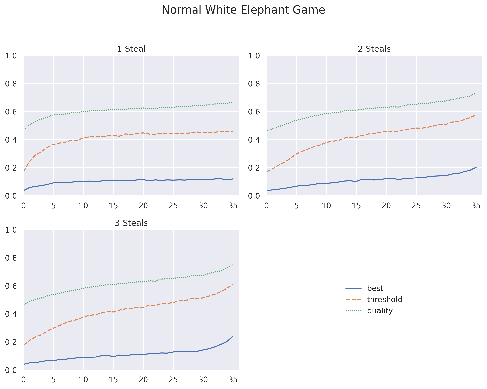
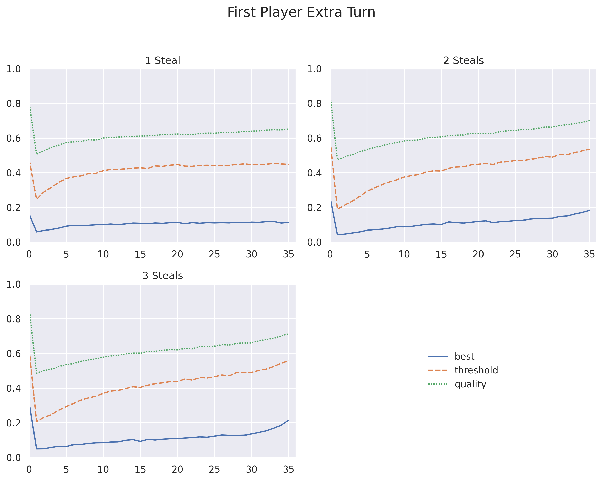
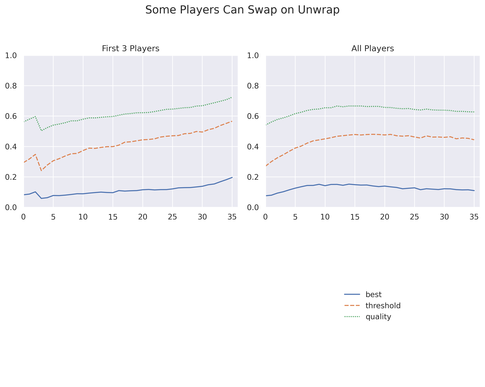
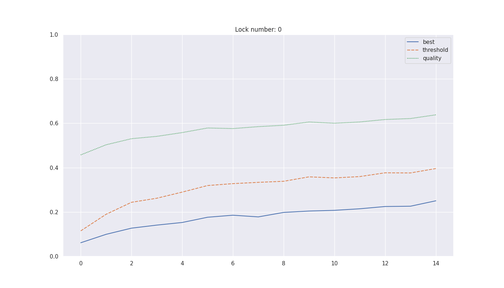
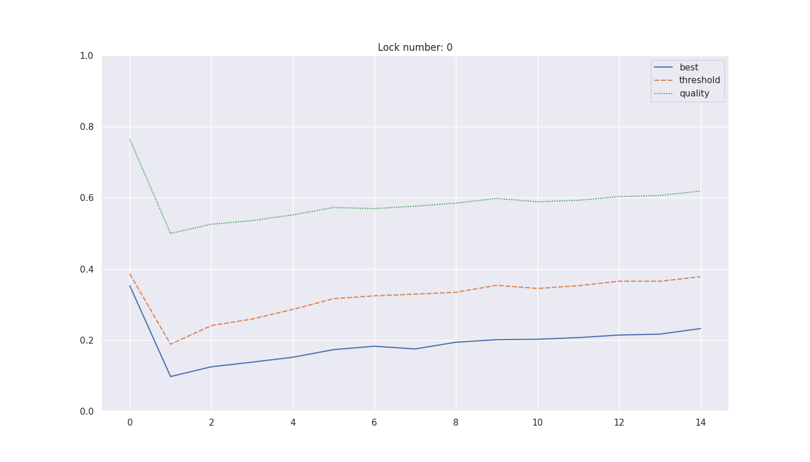
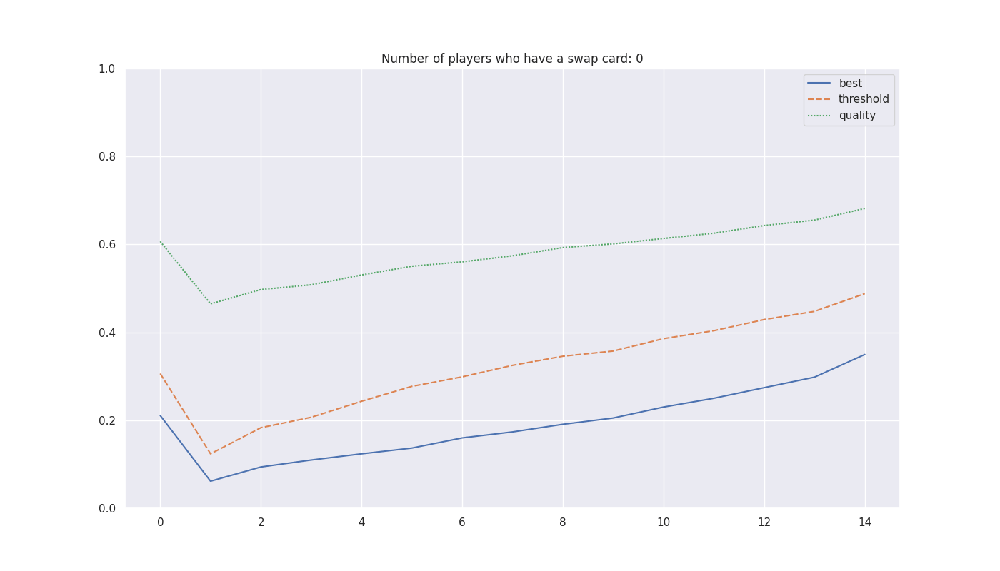

# Balancing the Elephant


This repository contains a Python simulation of a **White Elephant (a.k.a. Yankee Swap)** gift exchange game. The model captures realistic player behavior, gift quality variation, stealing rules, and several experimental rule variants.

The code is designed for **experimentation and analysis**, not UI or gameplay. It is especially suitable for:

* Studying fairness and advantage in turn order
* Exploring how gift quality distributions affect outcomes
* Comparing White Elephant rule variants
* Running Monte Carlo simulations

---

## Overview

At a high level, the simulation consists of:

* **Gifts** with intrinsic quality modifiers
* **Players** with heterogeneous preferences and risk thresholds
* A **turn-based game engine** that enforces White Elephant rules
* Optional **variants** such as early swap cards or extra turns

Each player acts greedily based on their private desirability scores, subject to a personal threshold that determines whether stealing is worth it.

---

## Core Concepts

### Gifts

Each gift:

* Has a unique ID
* Has a hidden quality modifier (possibly including rare "jackpots")
* Can only be stolen a limited number of times (`lock_num`)
* May temporarily or permanently lock against further steals

Gift quality influences how much players value the gift but is never directly observed by them.

---

### Players

Each player:

* Has a unique desirability score for *every* gift
* Holds exactly one gift by the end of the game
* Has a personal **stealing threshold**
* May hold a **swap card** (variant-dependent)

Players are not strategic planners. They act myopically:

> *"Is the best available gift better than what I’m willing to accept?"*

---

### Turn Mechanics

On a player’s turn:

1. All currently stealable gifts are identified
2. The most desirable available gift is selected
3. If its desirability exceeds the player’s threshold:

   * The gift is stolen
   * The robbed player immediately takes a turn
4. Otherwise:

   * The player unwraps a random remaining gift
   * The round advances

This recursion models the classic White Elephant steal chains.

---

## Game Variants

The simulation supports multiple rule variants via the `variant` parameter:

### `normal` (default)

* Standard White Elephant rules
* No swaps beyond normal steals

### `early_player_swaps`

* The first `swap_card_thresh` players receive a one-time swap card
* When a gift is unwrapped, eligible players may swap if:

  * They prefer the new gift
  * The desirability is close to their threshold

This models promotional or experimental rule sets.

### `p1_extra_turn`

* Player 1 receives an additional post-game swap opportunity
* Useful for testing first-player advantage

---

## Jackpot Gifts

When `jackpot=True`, gift quality is sampled from a distribution with:

* A small negative-to-neutral base range
* A low-probability, large positive bonus ("jackpot")

This creates rare, extremely valuable gifts that can dominate steal behavior.

---

## Code Structure

```
white_elephant/
│
├── Gift
│   └── Tracks quality, steals, and lock state
│
├── Player
│   └── Stores desirabilities, threshold, and swap ability
│
├── WhiteElephantGame
│   ├── Game initialization
│   ├── Turn execution
│   ├── Stealing and swapping logic
│   └── Variant handling
│
└── sample_gift_quality
    └── Gift quality sampling with optional jackpots
```

---

## Example Usage

```python
from white_elephant import WhiteElephantGame

game = WhiteElephantGame(
    n_players=10,
    seed=42,
    jackpot=True,
    variant="normal"
)

game.run()

# Inspect results
for player in game.players:
    print(player.id, player.gifts_held)
```

---

## Design Notes

* **Deterministic reproducibility** is supported via random seeds
* All player preferences are fixed at initialization
* No player has access to global game state or future information
* The model intentionally avoids dynamic re-evaluation of desirability

These constraints make the simulation suitable for statistical analysis and academic-style modeling.

---

## Analysis

In analyzing White Elephant, we take an approach that attempts to balance the game. We propose three metrics for doing this:

What is the desirability of the item a player ends up with? (**quality**)

Did the player end the game with their most desirable item? (**best**)

Did the player end the game with an item that is above their desirability threshold? (**threshold**)

The first metric is represented by a continuous variable, while the latter two are boolean values that we treat as 1 or 0 (affirmative or not). We analyze these metrics by simulating many games, fixing a player position, and taking averages.

Many of the raw numbers are determined by heuristic modeling choices when assigning desirability and quality. Additionally, the “players” in these simulations behave in a myopic, or pseudo-greedy, manner. This model does not attempt to capture psychological or long-term strategic behavior. Nonetheless, the results are interesting due to the global shape of the resulting curves. Despite the myopic setup, the data both confirms suspected imbalances in the gameplay—giving a relational feel to questions like “how much more advantageous is it to be the last player than the first?”—and, when examining variants, suggests that more balanced versions of the game may exist. These variations may require more strategy and cunning.

### The Normal Variation

The normal variation shows a clear advantage for later players and a disadvantage for earlier players. Later players have both more information and more options. Not only that, but acting later in the game also means fewer remaining opportunities for others to steal from them. The only true disadvantage a later player may face is the inability to act before certain desirable gifts are locked. As a result, the late-player advantage becomes even more pronounced as we increase the number of times a gift can be stolen.

We note that the variation in which only one steal is allowed before an item is locked appears to be mostly equitable. However, it also seems somewhat boring, and the first players still experience significant disadvantages.

All of these curves appear to have extrema only at the ends of their domain. In other words, this suggests that there is no hidden advantage to being in the middle. The next position is always more advantageous in White Elephant—at least in a general sense. But hopefully, you never have to play 10,000 White Elephant games in your lifetime!



### The Giving the First Player Another Chance

Some White Elephant variations allow the first player to take a “wrap-around” turn. After the final player has acted, the first player gets a chance to swap their gift with another unlocked gift. This is an attempt to balance the game, given the concession (as shown above) that going first is indeed disadvantageous.

However, this change gives the first player a substantial advantage—often exceeding that of the last player—while player two remains at a severe disadvantage. This variation still exhibits a wide spread between the lowest and highest values across all metrics.

Unlike the normal game curves, these curves have a distinct minimum in the middle of the game, specifically at player two. This is not surprising, nor is the fact that these curves are clearly not smooth.




### Letting Players Swap Unwanted Gifts

One potential way to balance White Elephant is to let the game continue with swaps until all presents are locked. However, White Elephant is supposed to be fun, and that approach sounds tedious and exhausting. Instead, we consider a variation that encourages swapping during normal gameplay: **White Elephant: Swap Attack** (WE:SA).

This variant originated from asking what would happen if the first few players (say, three) were allowed to “call a swap” on a gift immediately after it is unwrapped. In this action, there is a wanted gift (the newly unwrapped one) and an unwanted gift. This swap could only be used once and would count toward the wanted gift’s steal count, but not the unwanted gift’s.

The usefulness of this mechanic is inversely correlated with player position: the first player can use it throughout the game, while the last player cannot use it at all. In this sense, it introduces a balancing force. Notably, it differs from a normal steal in that it cannot create steal chains.

One issue with this approach is deciding which players should receive this swap ability. It does not scale cleanly: any cutoff point introduces a sharp disadvantage for the next player. However, given the inverse usefulness described above, there is little downside to simply allowing all players to use this ability. Doing so produces more pleasing curves, and while some imbalance remains, it is significantly reduced.

This is the first time in our metric graphs that the most advantageous position appears naturally in the center of the player order. We hypothesize that this results from an interplay between the late-game advantage of stealing gifts and the early-game advantage of being able to swap unwanted gifts.




### Animations

#### Normal play: number of steals a gift can have increases


#### Variant Comparison: Player 1 Swaps at the End


#### Variant: Player Swaps


<!-- 
## Limitations

* No validation of impossible states (assumes correct usage)
* Recursion depth grows with long steal chains (should not be a problem with reasonable number of players and allowable stealing)
* Players only hold one gift in the current model
* No learning, memory, or strategic planning

---

## Suggested Extensions

* Multi-gift holding variants
* Explicit utility functions instead of thresholds
* Group-level fairness metrics
* Visualization of steal graphs
* Refactoring recursion into an explicit turn stack -->

---

## License

This code is provided for experimentation and analysis. No warranty is implied.

---

If you are using this model for research, simulation studies, or blog posts, consider documenting the variant parameters and random seeds for reproducibility.
